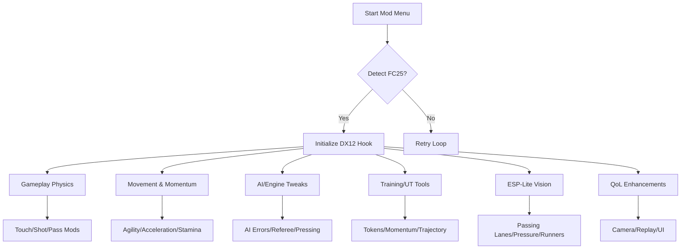

## Overview 🌟

The **EA SPORTS FC 25 Mod Menu** gives you granular control over every pulse of a match. From player physics to AI intelligence, visual cues to stamina flow, the menu is built to empower—not overwhelm. Every module is built to be modular, human-like, and intuitive.

[!NOTE]
All systems are standalone. Enable only what your style demands.

---

## Feature Overview 🧬

### **Gameplay Physics & Ball Control Mods**

* **First Touch Cushioning** – Reduces bounce and heavy touches.
* **Pass Magnetism Curve** – Adaptive improvement to ground, lob, and through-balls.
* **Shot Stability Mod** – Decreases randomness in accuracy and finesse shots.
* **Dribble Grip Enhancer** – Better control during tight footwork.

### **Player Movement & Momentum Tools**

* **Acceleration/Pace Editor** – Tune explosive bursts without breaking animations.
* **Sprint Stamina Rebalancer** – Reduce fatigue for longer runs.
* **Agility Curve Sculptor** – Reworks turning speed during sprints.
* **Defensive Auto-Assist Bias** – Smooth tracking of opposing attackers.

### **AI & Match Engine Behavior**

* **AI Error Bias** – Forces more realistic mistakes in passes, tackles, and positioning.
* **Keeper Reaction Tuner** – Adjust keeper strength from weak to superhuman.
* **Referee Strictness Slider** – More lenient or more punishing foul calls.
* **Pressing Intensity Mod** – Modify CPU team pressing and spacing.

### **Ultimate Team & Training Utilities**

* **Infinite Training Tokens**
* **Instant Skill Upgrade Mode**
* **Momentum Freeze Switch** – Prevents dynamic difficulty swings offline.
* **Practice Aim-Line Overlay** (training mode only).

### **ESP-Lite Tactical Vision**

* **Passing Lane Glow** – Reveals optimal passing opportunities.
* **Pressure Radar Arrows** – Indicators for incoming defenders.
* **Energy/Stamina Glow** – Real-time stamina cues above players.
* **Off-ball Runner Indicators** – Shows wingers making hidden runs.

### **Quality-of-Life Enhancements**

* **Auto-Skip Cutscenes**
* **Ultra-Fast Replay Speed**
* **Camera Unlocker** – Expanded zoom/FOV values.
* **HUD Minimizer** – Cleaner interface during intense matches.

---


---

## Setup ⚡

1. Extract the Mod Menu to any folder outside system directories.
2. Launch *EA SPORTS FC 25* in borderless or windowed mode.
3. Start the mod menu as administrator.
4. Choose `FC25.exe` from the process list.
5. Toggle modules individually or load one of the presets.

Quick start example:

```bash
fc25-modmenu.exe -p FC25.exe -dx12hook -profile maestro
```

[!WARNING]
Disable secondary overlays (MSI OSD, Nvidia Performance Overlay, OBS Game Capture) to avoid DX12 injection conflicts.

---

## Internal Architecture (Mermaid Diagram)



---

## Example Presets ⚽🔥

### **Tiki-Taka Maestro** – Control the match

* Pass Magnetism: High
* Touch Cushioning: High
* AI Error Rate: Mild
* Stamina Loss: Low
* Passing Lane ESP: Enabled

### **Striker’s Edge** – Perfect for goal-hunters

* Shot Stability: High
* Acceleration Boost: Medium
* Keeper Reaction: Slightly reduced
* Runner Indicators: On
* Pressure Radar: On

### **Ultra Simulation Mode** – Realistic but easier

* Referee Strictness: Balanced
* AI Error Bias: Modest
* Sprint Stamina Loss: Slightly reduced
* ESP-Lite: Minimal
* Camera Unlocker: Enabled

---

## Configuration Example

```ini
[PHYSICS]
pass_magnetism=1.25
first_touch_cushion=0.80
shot_stability=1.20
dribble_grip=1.10

[MOVEMENT]
acceleration=1.15
stamina_loss=0.65
agility_curve=0.90
defense_assist=0.25

[AI]
error_bias=0.12
keeper_reaction=0.10
ref_strictness=0.6
pressing_intensity=0.85

[TRAINING]
infinite_tokens=true
momentum_freeze=true
training_aim_line=true

[ESP]
passing_lane_glow=true
pressure_arrows=true
stamina_glow=true
runner_indicators=true
opacity=0.75

[QOL]
autoskip_cutscenes=true
camera_unlocker=true
fast_replay=true
hud_minimizer=true
```

---

## Technical Notes 🧪

* Overlay refresh: **70–130 ms** depending on active modules.
* DX12 hooking optimized for 60–240 FPS gameplay.
* Config files auto-save on exit.
* Safe-mode scanner updates offsets after patches.

[!IMPORTANT]
After large EA patches, perform a full offset scan before enabling gameplay or physics edits.

---

## FAQ ❓

### Does this work with controllers?

Yes—includes stick curves and defensive tracking smoothing.

### Can I disable all gameplay mods and use only visuals?

Yes. ESP-Lite and QoL tools work independently.

### Does it affect online modes like FUT?

Use responsibly. Visual-only features are safest for online environments.

### Does ultrawide work properly?

Absolutely—ESP and camera unlocker scale up to 32:9.

### Can presets be exported?

Yes—`.ini` files are fully portable and sharable.

---

## Final Thoughts 🌠

Football is rhythm—decision, instinct, geometry, tempo. The **EA SPORTS FC 25 Mod Menu** doesn’t rewrite that rhythm; it helps you synchronize with it. Every touch a little softer, every attack a little clearer, every transition a breath smoother. A quiet companion on the path to mastery.
